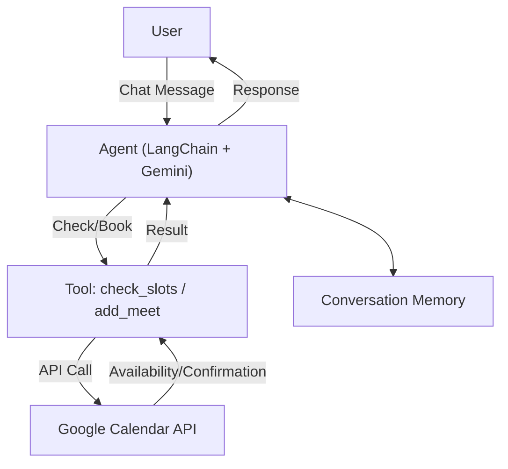

# Voice-based Smart Scheduler Agent

A conversational AI assistant that helps users schedule meetings with "Harsimran Singh" by interacting with Google Calendar. The agent uses natural language understanding to collect meeting details, check calendar availability, and book meetings, all through a chat interface.

---
## Demo Video 
LINK :- https://www.youtube.com/watch?v=cFaSo3wm_JQ
## Tech Stack

- **Python**: Core programming language.
- **LangChain**: For building conversational agents and prompt management.
- **Google Generative AI (Gemini)**: For LLM-powered conversation.
- **Google Calendar API**: For checking availability and scheduling meetings.
- **dotenv**: For environment variable management.
- **Pandas, NumPy**: For data handling (minimal use).
- **OAuth2**: For secure Google Calendar access.

---

## Data Flow

1. **User Input**: User sends a scheduling request via chat.
2. **Conversation Memory**: The agent maintains chat history for context.
3. **Intent Recognition**: The LLM interprets user intent (e.g., check slots, book meeting).
4. **Tool Invocation**:
    - If checking availability: Calls `check_slots` tool, which queries Google Calendar for free/busy times.
    - If booking: Calls `add_meet` tool, which creates a new event in Google Calendar.
5. **Google Calendar API**: Handles authentication and actual calendar operations.
6. **Response Generation**: The agent responds with available slots, booking confirmation, or requests for missing details.
7. **User Receives Output**: The user sees the agent's response in the chat interface.

---

## Data Flow Diagram



---

## Setup & Usage

1. **Clone the repository** and install dependencies:
    ```bash
    pip install -r requirements.txt
    ```
2. **Set up environment variables** in a `.env` file:
    - `GOOGLE_API_KEY`
    - Any other required keys.
3. **Google Calendar API**:
    - Place your `credentials.json` in the project root.
    - The first run will prompt for Google authentication and create `token.json`.
4. **Run the agent**:
    ```bash
    python main.py
    ```
5. **Interact via the web interface** (if Flask is used) or command line.

---

## Features

- Conversational scheduling with context retention.
- Suggests best available time slots.
- Books meetings only after collecting all required details (name, email, time).
- Handles authentication and token refresh for Google Calendar.
- Customizable for other users or calendars.

---

## License

MIT License 
